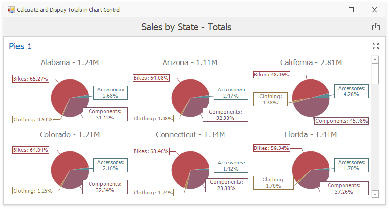

<!-- default badges list -->

<!-- default badges end -->

# Dashboard for WinForms - How to Display the Total Value Above Each Pie Chart

This example demonstrates how to access the [underlying chart control](https://docs.devexpress.com/Dashboard/18019) in the [Pie dashboard item](https://docs.devexpress.com/Dashboard/15262) and display the **Total** value in the chart title.

## Files to Review

* [Form1.cs](./CS/TotalsInChartsExample/Form1.cs) (VB: [Form1.vb](./VB/TotalsInChartsExample/Form1.vb))

Set the [DashboardViewer.CalculateHiddenTotals](https://docs.devexpress.com/Dashboard/DevExpress.DashboardWin.DashboardViewer.CalculateHiddenTotals) property to **true** to calculate the totals automatically. 

API in this example:

* [DashboardViewer.CalculateHiddenTotals](https://docs.devexpress.com/Dashboard/DevExpress.DashboardWin.DashboardViewer.CalculateHiddenTotals) property
* [DashboardViewer.DashboardItemControlUpdated ](https://docs.devexpress.com/Dashboard/DevExpress.DashboardWin.DashboardViewer.DashboardItemControlUpdated) event
* [DashboardItemControlEventArgs.ChartControl](https://docs.devexpress.com/Dashboard/DevExpress.DashboardWin.DashboardItemControlEventArgs.ChartControl) property
* [ChartControl.Series](https://docs.devexpress.com/WindowsForms/DevExpress.XtraCharts.ChartControl.Series) property
* [Series.Tag](https://docs.devexpress.com/CoreLibraries/DevExpress.XtraCharts.ChartElement.Tag) property
* [Title.Text](https://docs.devexpress.com/CoreLibraries/DevExpress.XtraCharts.Title.Text) property
* [AxisPoint](https://docs.devexpress.com/Dashboard/DevExpress.DashboardCommon.ViewerData.AxisPoint) class
* [DashboardViewer.GetItemData](https://docs.devexpress.com/Dashboard/DevExpress.DashboardWin.DashboardViewer.GetItemData(System.String)) method
* [MultiDimensionalData](https://docs.devexpress.com/Dashboard/DevExpress.DashboardCommon.ViewerData.MultiDimensionalData) class
* [MultiDimensionalData.GetMeasures](https://docs.devexpress.com/Dashboard/DevExpress.DashboardCommon.ViewerData.MultiDimensionalData.GetMeasures) method
* [MultiDimensionalData.GetSlice](https://docs.devexpress.com/Dashboard/DevExpress.DashboardCommon.ViewerData.MultiDimensionalData.GetSlice.overloads) method

## Documentation

* [Obtaining Underlying and Displayed Data](https://docs.devexpress.com/Dashboard/17269/creating-the-designer-and-viewer-applications/winforms-viewer/obtaining-underlying-and-displayed-data)

## More Examples 

* [Web Dashboard - How to display the Total value above each Pie Chart](https://github.com/DevExpress-Examples/how-to-display-the-total-value-above-each-pie-chart-t543185)
* [How to: Obtain a Dashboard Item's Client Data in the WinForms Viewer](https://github.com/DevExpress-Examples/how-to-obtain-a-dashboard-items-client-data-in-the-winforms-viewer-t140553)
* [How to: Add Custom Interactivity to a Dashboard Displayed in the WinForms Viewer](https://github.com/DevExpress-Examples/how-to-add-custom-interactivity-to-a-dashboard-displayed-in-the-winforms-viewer-t189795)
* [How to: Calculate and Display Totals for the Hidden Measure](https://github.com/DevExpress-Examples/winforms-dashboard-how-to-display-hidden-field-totals)
* [How to: Customize the Data Inspector Dialog](https://github.com/DevExpress-Examples/winforms-dashboard-data-inspector-customization)

<!-- feedback -->
## Does this example address your development requirements/objectives?

 

(you will be redirected to DevExpress.com to submit your response)
<!-- feedback end -->
